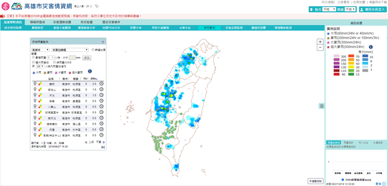

# 降雨觀測

可觀看各測站即時降雨觀測資料，本網站起始設定為24小時內降雨情形，並將達大雨等級之觀測站顯示於地圖中。

畫面中左側為客製化表單，可依使用者需求自行設定顯示之雨量站，如(1)依各縣市，篩選不同單位雨量站是否顯示；(2)自行設定1、3、6、12、24小時，累積雨量大於某mm之雨量站；(3)亦可直接勾選顯示達大雨等級，或時雨量大於零之雨量站；(4)可選擇是否僅顯示24小時內有符合上述條件之雨量站。

